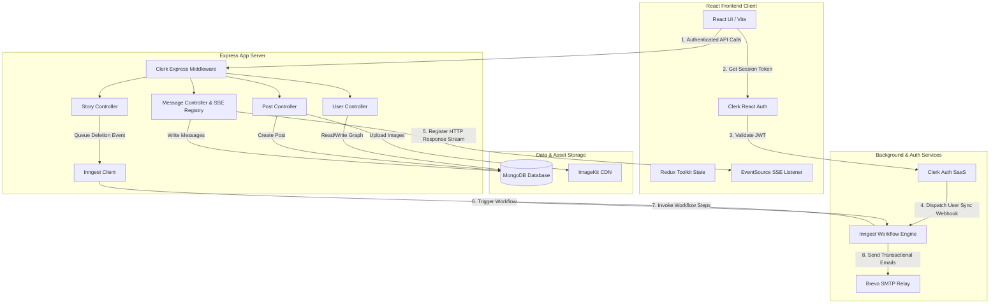
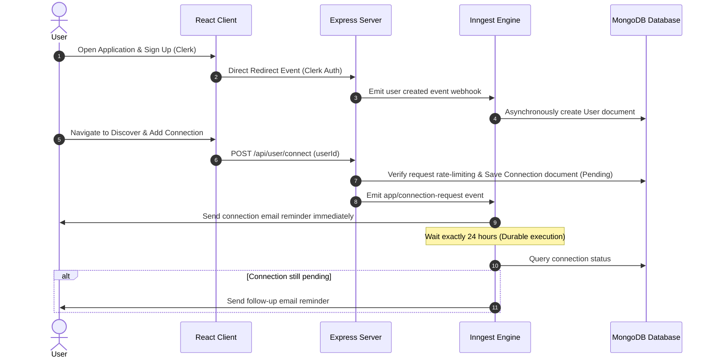
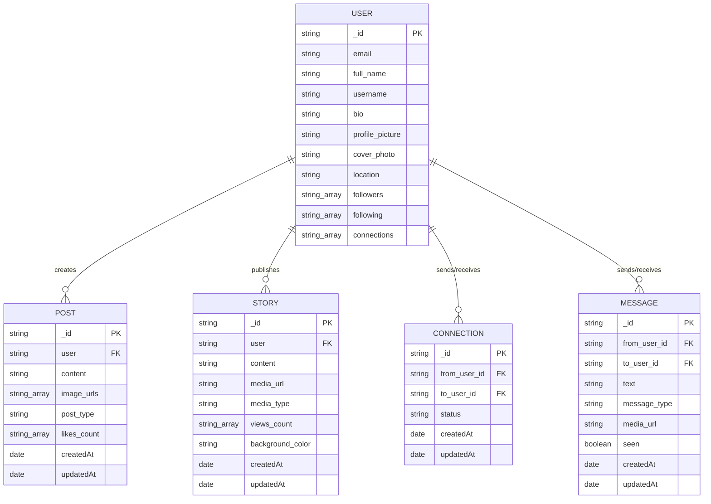

# Hangout — Social Media Web Application

A centralized, algorithm-free space to build authentic relationships directly with your specific audience. Built for privacy-focused groups and communities.

[](https://nodejs.org)
[](https://react.dev)
[](https://redux-toolkit.js.org)
[](https://tailwindcss.com)
[](https://inngest.com)
[](https://clerk.dev)
[](https://mongodb.com)

[Live Demo [Add deployed application URL]] | [Documentation [Add documentation URL]] | [Report a Bug [Add bug report URL]] | [Request a Feature [Add feature request URL]]

---

## Table of Contents
1. [Project Overview](#2-project-overview)
2. [Demo and Screenshots](#3-demo-and-screenshots)
3. [Key Features](#4-key-features)
4. [What Makes This Project Stand Out](#5-what-makes-this-project-stand-out)
5. [Technology Stack](#6-technology-stack)
6. [System Architecture](#7-system-architecture)
7. [Project Structure](#8-project-structure)
8. [Application Workflow](#9-application-workflow)
9. [Getting Started](#10-getting-started)
10. [Usage Guide](#11-usage-guide)
11. [API Documentation](#12-api-documentation)
12. [Database Design](#13-database-design)
13. [Authentication and Authorization](#14-authentication-and-authorization)
14. [Testing](#15-testing)
15. [Challenges and Technical Learnings](#16-challenges-and-technical-learnings)
16. [Future Improvements](#17-future-improvements)
17. [Deployment](#18-deployment)
18. [Performance, Security, and Accessibility](#19-performance-security-and-accessibility)
19. [Contribution Guidelines](#20-contribution-guidelines)
20. [Credits and Acknowledgements](#21-credits-and-acknowledgements)
21. [License](#22-license)
22. [Contact](#23-contact)

---

## 2. Project Overview

**Hangout** is a dedicated, self-hosted social networking platform designed to combat the issues of audience fragmentation and corporate algorithmic control. Traditional networks force creators, privacy-focused organizations, and close-knit communities to compete against opaque optimization loops to reach their own followers. 

Hangout solves this problem by providing a direct, chronological, and distraction-free communication space. The application is built around a secure user relationship graph, allowing users to connect, send instant messages, aggregate feeds, and share ephemeral stories—all within an environment where the community owns their interaction data.

---

## 3. Demo and Screenshots

*   **Live Deployed Application:** [(https://hang-out-teal.vercel.app/)] 
*   **Video Demo / Walkthrough:** [Add walkthrough URL]

```md
<!-- Note: Replace these placeholders with actual screenshots once files are uploaded -->

*Figure 1: Chronological posts aggregator and global user feed layout.*


*Figure 2: Real-time private chat UI with support for image attachments.*


*Figure 3: Connection request system, displaying mutual friends, pending requests, and followers.* 
```

---

## 4. Key Features

### Real-Time Communication
*   **SSE-Backed Chat Pipelines:** Implements instant message delivery using Server-Sent Events. Messages are delivered dynamically in the active viewport or as pop-up notifications when users navigate away.
*   **Image Attachments in Chat:** Users can upload images directly into private chats, optimized dynamically before delivery.

### Ephemeral Content
*   **24-Hour Stories:** Users can upload images, videos, or stylized text stories with customizable background colors, which automatically expire after 24 hours.

### Relationship Graphs & Networking
*   **Dual-State Networks:** Supports standard unilateral "following" paths (similar to Twitter/Instagram) alongside mutual "connections" (similar to LinkedIn).
*   **User Discovery Engine:** Dynamic database query filters that allow users to search for peers by name, location, username, or email address.

### Content Feeds
*   **Chronological Feed Aggregator:** Feeds aggregate posts from the logged-in user, their mutual connections, and users they follow, sorted by creation date.
*   **Multi-Format Post Creator:** Supports text-only posts, image carousels, or mixed-media posts.

---

## 5. What Makes This Project Stand Out

### 1. Complex Durable Background Workflows
Rather than relying on volatile, in-memory Node.js timers that fail during server redeploys, Hangout utilizes a **durable step-based execution engine (Inngest)**. Features like the 24-hour story cleanup use durable sleep states that survive server restarts, preventing database fragmentation.

### 2. High-Performance, Low-Overhead SSE Real-Time Channel
Rather than maintaining bidirectional TCP handshakes (WebSockets) that consume high server resources during periods of user inactivity, Hangout implements **Server-Sent Events (SSE)**. This architectural choice uses standard HTTP connections to push messages to clients, while client updates are sent via standard REST POST requests.

### 3. Rate-Limited Connection Security
To prevent database spam and bot-driven script abuse, the connection request engine enforces an API-level sliding-window rate limit (maximum 20 requests per 24 hours per account).

---

## 6. Technology Stack

| Layer | Verified Technologies | Selection Rationale |
| :--- | :--- | :--- |
| **Frontend** | React (v19.2.0), Redux Toolkit (v2.11.2), Vite, Tailwind CSS (v4.1.17) | Rapid Hot Module Replacement (HMR) for development, slice-based frontend state sync, and responsive styling. |
| **Backend** | Node.js, Express.js (v5.2.1) | Non-blocking, asynchronous routing designed for holding persistent SSE connections open. |
| **Database** | MongoDB, Mongoose (v9.0.1) | Document-oriented collections matching JSON posts and user profiles; rapid write speeds. |
| **Authentication** | Clerk (@clerk/clerk-react, @clerk/express) | Seamless secure user signup, session token management, and verified email flows. |
| **Workflows / Jobs** | Inngest (v3.47.0) | Durable execution queue for background events, daily crons, and 24-hour delayed jobs. |
| **Media Delivery** | ImageKit (@imagekit/nodejs, Multer) | Automated image transformations (quality compression, WebP resizing) to reduce bandwidth. |
| **Notifications** | Nodemailer, Brevo SMTP Relay | Real-time email reminders for pending connections and daily unseen message digests. |

---

## 7. System Architecture

Hangout uses a decoupled frontend client and a stateless backend server, connected via standard REST endpoints, Webhook streams, and SSE push streams.



---

## 8. Project Structure

```text
HangOut/
├── client/                 # React frontend application
│   ├── src/
│   │   ├── api/            # Axios API config
│   │   ├── app/            # Redux store definition
│   │   ├── components/     # Shared UI components (PostCard, StoryViewer, Notification)
│   │   ├── features/       # Redux slices (user, connections, messages)
│   │   ├── pages/          # Layout views (Feed, Messages, ChatBox, Connections)
│   │   ├── App.jsx         # App route router & central SSE listener
│   │   └── main.jsx        # Mount entry point
│   ├── package.json        # Frontend dependencies & run scripts
│   └── vite.config.js      # Vite build configuration
├── server/                 # Express backend API server
│   ├── configs/            # Configs for MongoDB, ImageKit, Multer, and Nodemailer
│   ├── controllers/        # Route controllers (user, post, story, message)
│   ├── inngest/            # Inngest event listener functions & background steps
│   ├── middlewares/        # Express middleware (Clerk authentication protect)
│   ├── models/             # Mongoose schemas (User, Connection, Post, Story, Message)
│   ├── routes/             # REST routing tables
│   ├── package.json        # Backend package definition
│   └── server.js           # Server application configuration
└── README.md
```

### Folder Responsibilities:
*   `client/src/features`: Isolates client state mutations (authentication status, real-time message arrays, connection lists).
*   `server/inngest`: Manages event listeners that are decoupled from Express endpoints to handle heavy computations, delayed database writes, and automatic cron jobs.
*   `server/configs`: Centralized middleware modules that instantiate third-party connections (database links, CDN storage SDK, transport layer mailers).

---

## 9. Application Workflow



---

## 10. Getting Started

### Prerequisites
*   **Node.js:** v18.0.0 or higher
*   **npm:** v9.0.0 or higher (or Yarn/pnpm)
*   **MongoDB Instance:** Local MongoDB community server or a MongoDB Atlas URI
*   **Clerk Credentials:** Auth keys for Client and Server
*   **ImageKit Account:** Public/Private key pair and endpoint URL for cloud media hosting

### Clone the Repository
```bash
git clone https://github.com/Skc-VitInProjects/HangOut.git
cd HangOut
```

### Install Dependencies

#### Install Frontend Dependencies
```bash
cd client
npm install
```

#### Install Backend Dependencies
```bash
cd ../server
npm install
```

### Environment Variables

Prepare a `.env` file in **both** folders before running the app.

#### Frontend configuration (`client/.env`)
Create a file at `client/.env`:
```env
VITE_CLERK_PUBLISHABLE_KEY=your_clerk_publishable_key
VITE_BASEURL=http://localhost:4000
```

#### Backend configuration (`server/.env`)
Create a file at `server/.env`:
```env
FRONTEND_URL=http://localhost:5173
MONGODB_URL=your_mongodb_connection_string
INNGEST_EVENT_KEY=your_inngest_event_key
INNGEST_SIGNING_KEY=your_inngest_signing_key
CLERK_PUBLISHABLE_KEY=your_clerk_publishable_key
CLERK_SECRET_KEY=your_clerk_secret_key
IMAGEKIT_PUBLIC_KEY=your_imagekit_public_key
IMAGEKIT_PRIVATE_KEY=your_imagekit_private_key
IMAGEKIT_URL_ENDPOINT=your_imagekit_endpoint
SENDER_EMAIL=your_sending_email_address
SMTP_USER=your_smtp_relay_username
SMTP_PASS=your_smtp_relay_password
PORT=4000
```

### Run the Application

#### Start the Server Dev Engine
```bash
cd server
npm run server
```
*   The backend server runs locally on `http://localhost:4000`.

#### Start the Inngest Dev Server (Required for Workflows)
In a separate terminal:
```bash
npx inngest-cli@latest dev -u http://localhost:4000/api/inngest
```

#### Start the Client Dev Engine
```bash
cd client
npm run dev
```
*   Open your browser to `http://localhost:5173`.

---

## 11. Usage Guide

1.  **Authentication:** Authenticate through Clerk. Upon your first login, a webhook syncs your details from Clerk to the local MongoDB database.
2.  **Profiles & Updates:** Navigate to the **Profile** page, click the edit options, and customize your bio, profile picture, location, and cover photos (these assets are uploaded and served via ImageKit).
3.  **Discovery:** Navigate to the **Discover** tab and type keywords (usernames, real names, or locations) to find other users.
4.  **Connections:** Send a connection request. Once they accept your request, both of you will be added to each other's "Connections" view, enabling private messaging.
5.  **Messaging:** Click the chat bubble on any mutual connection to start private messages. You can also upload images within the chat.

---

## 12. API Documentation

All API endpoints are protected using authentication checks and expect a Clerk JWT token in the `Authorization` header (`Bearer <token>`).

| Method | Endpoint | Description | Auth |
| :--- | :--- | :--- | :--- |
| `GET` | `/api/user/data` | Retrieves the profile data of the logged-in user. | Yes |
| `POST`| `/api/user/update` | Updates user details, profile pictures, and cover photos. | Yes |
| `POST`| `/api/user/connect` | Initiates a mutual connection request to a target user. | Yes |
| `GET` | `/api/user/connections` | Fetches active connections, followers, and pending requests. | Yes |
| `POST`| `/api/post/add` | Creates a user post (supports text and multiple images). | Yes |
| `GET` | `/api/post/feed` | Pulls chronological posts from user and connected peers. | Yes |
| `POST`| `/api/story/create` | Uploads a text/media story (expires in 24 hours). | Yes |
| `GET` | `/api/message/:userId` | Initiates a Server-Sent Events (SSE) connection stream. | No (params) |
| `POST`| `/api/message/send` | Sends a message containing text or files. | Yes |

### Endpoint Payload Examples

#### Send Message (`POST /api/message/send`)
**Request (FormData):**
*   `to_user_id`: `"user_abc123"`
*   `text`: `"Hey, did you review the project architecture docs?"`
*   `image`: `[File Object]` *(Optional)*

**Response (JSON):**
```json
{
  "success": true,
  "message": {
    "_id": "64b0f7e12c12a83f98c1998f",
    "from_user_id": "user_xyz789",
    "to_user_id": "user_abc123",
    "text": "Hey, did you review the project architecture docs?",
    "message_type": "text",
    "media_url": "",
    "seen": false,
    "createdAt": "2026-07-10T17:21:00.000Z",
    "updatedAt": "2026-07-10T17:21:00.000Z"
  }
}
```

---

## 13. Database Design

Hangout uses MongoDB to manage relationships, user posts, and private message data.



---

## 14. Authentication and Authorization

*   **Managed Access Strategy:** Secure authentication and authorization are handled externally via Clerk. 
*   **Backend JWT Validation Check:** Custom middleware interceptor [auth.js](file:///c:/Users/Lenovo/Social_Media/server/middlewares/auth.js) intercepts incoming requests:
    ```javascript
    export const protect = async (req, res, next) => {
      try {
        const { userId } = await req.auth();
        if (!userId) {
          return res.json({ success: false, message: "not authenticated" });
        }
        next();
      } catch (error) {
        res.json({ success: false, message: error.message });
      }
    };
    ```
*   **Database Isolation Protection:** Users can only fetch and update records using the authentication context returned by `req.auth()`, preventing access key forgery.

---

## 15. Testing

### Test Suite Execution
This repository currently does not include an explicit automated unit or integration testing framework. 

### Recommended Tests
To ensure core workflows remain stable, we recommend adding:
1.  **Frontend Component Unit Tests (Vitest & React Testing Library):** Mock Redux wrappers to test user profile form logic in `ProfileModel.jsx` and the message rendering loops in `ChatBox.jsx`.
2.  **API Integration Tests (Supertest & Jest):** Verify JWT verification headers, check rate limits on `/api/user/connect`, and test that SSE pushes terminate correctly on channel closing.
3.  **Workflow Verification Tests (Inngest SDK Mocking):** Run integration tests targeting the `story-delete` and `send-new-connection-request-reminder` workflow handlers.

---

## 16. Challenges and Technical Learnings

### Technical Challenges Overcome

*   **Stateless Server Timers:** 
    *   *Problem:* The app requires stories to expire and delete automatically after 24 hours. Placing simple JavaScript `setTimeout()` operations inside Express controllers risks leaving expired stories in the database if the server restarts or scales down.
    *   *Solution:* Implemented step-level sleep execution using Inngest's state engine. If the server crashes or restarts, Inngest picks up the workflow where it left off, deleting stories on schedule.
*   **High-Volume Real-Time Syncing:**
    *   *Problem:* Synchronizing Clerk authentication state changes (signups, updates, deletions) with the local MongoDB database in real-time.
    *   *Solution:* Configured signed webhook validation matching events parsed in Inngest, allowing updates to run asynchronously in the background.

### Key Learnings
Through this project, I gained experience in:
1.  Writing **event-driven, durable background workflows** that isolate heavy compute tasks (like sending transactional emails and running daily cron tasks) from main routing loops.
2.  Configuring **Server-Sent Events (SSE)** for unidirectional real-time data streams, which reduced server resource utilization compared to bidirectional WebSockets.
3.  Optimizing image loading by implementing asset transformation rules (dynamic scaling, quality compression, and WebP conversion) via **ImageKit**.

---

## 17. Future Improvements

*   **SSE scaling with Redis Pub/Sub:** Transition the local, in-memory connection registry to a Redis database to support horizontal scaling across multiple servers.
*   **Cursor-Based Query Pagination:** Update MongoDB feed and message queries to load data incrementally using cursor-based pagination.
*   **Active Presence Tracker:** Add real-time user presence indicators (online/offline) to the connections sidebar.
*   **Read & Delivered Receipts:** Update the database and SSE messages to include read receipts when messages are viewed.

---

## 18. Deployment

### Deployment Strategy
This project is configured for cloud deployment. The configuration files suggest hosting the frontend on Vercel and the backend server on platforms like Render or Railway.

*   **Frontend (Vite App):** The `client/vercel.json` config maps SPA route handling correctly:
    ```json
    {
      "rewrites": [{ "source": "/(.*)", "destination": "/index.html" }]
    }
    ```
*   **Backend Server:** Can be deployed to any Node.js hosting platform (e.g., Render, Railway). Set up backend environment variables in your deployment dashboard and deploy directly from the `server` directory.

---

## 19. Performance, Security, and Accessibility

*   **Media Compression Pipeline:** Images are processed using ImageKit transformation parameters, converting assets to WebP formats and applying compression before they are served to clients.
*   **Rate-Limiting Protection:** A sliding-window rate limit is enforced on connection requests (maximum 20 requests per 24 hours) to prevent spam.
*   **Secure API Requests:** Authentication keys are kept hidden in backend modules. The frontend client does not have direct access to database engines or third-party email tools, preventing API key exposure.

---

## 20. Contribution Guidelines

We welcome contributions to Hangout! To contribute:

1.  Fork the repository.
2.  Create your feature branch:
    ```bash
    git checkout -b feature/amazing-feature
    ```
3.  Commit your changes with clear, descriptive messages:
    ```bash
    git commit -m "feat: add redis pub-sub backend sync to SSE controller"
    ```
4.  Push your changes to your branch:
    ```bash
    git push origin feature/amazing-feature
    ```
5.  Open a Pull Request from your fork to the main branch.

---

## 21. Credits and Acknowledgements

*   **Project Developer:** [Skand Kumar Choubey](https://github.com/Skc-VitInProjects)
*   **Libraries and Services:**
    *   Auth: [Clerk](https://clerk.com)
    *   Database Engine: [MongoDB Atlas](https://www.mongodb.com/cloud/atlas)
    *   Workflows Orchestration: [Inngest Engine](https://www.inngest.com)
    *   Cloud Storage Partner: [ImageKit.io](https://imagekit.io)
    *   Email Gateway Provider: [Brevo SMTP](https://www.brevo.com)

---

## 22. License

This repository currently does not include an explicit open-source license.

---

## 23. Contact

*   **GitHub:** [https://github.com/Skc-VitInProjects]
*   **LinkedIn:** [https://www.linkedin.com/in/skandkc/]
*   **Email:** [iskc9555@gmail.com]

---
 
## 24. Star the Project

If you find this project helpful, please give it a star! ⭐ It helps others discover the project. For bugs, features, or suggestions, feel free to open an issue.
